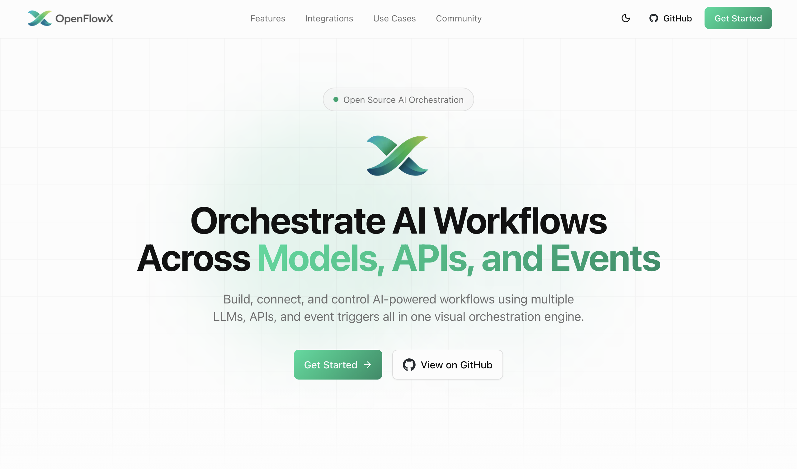
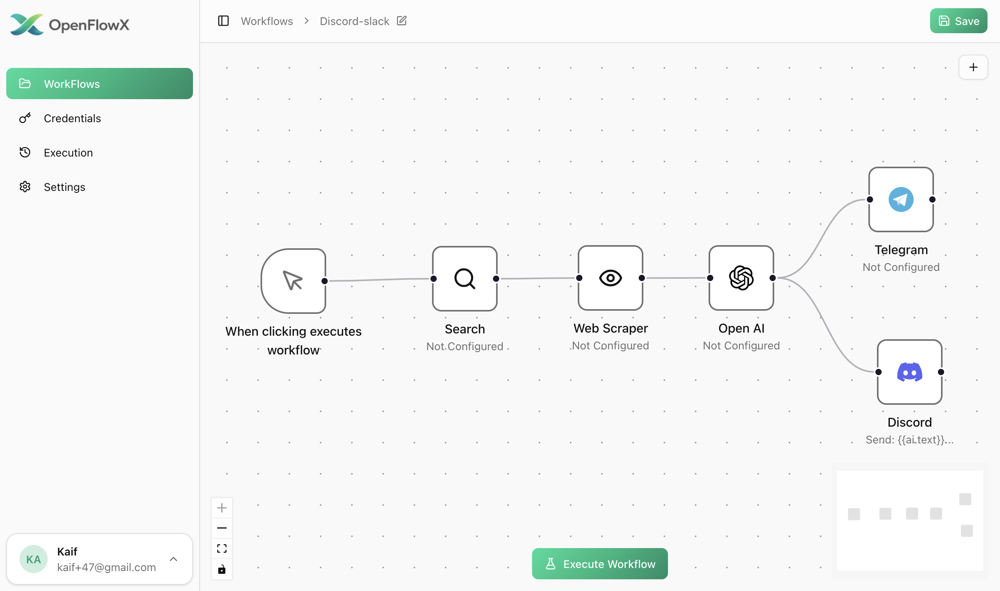

# OpenFlowX

**OpenFlowX** is an open-source, no-code workflow automation platform, built for automating tasks across APIs, AI models, and event-driven systems.

Design workflows visually, connect triggers and actions, and orchestrate logic without writing glue code.

🌐 **Live URL:** [https://www.openflowx.run](https://www.openflowx.run)

---

## Screenshots

### 🏠 Landing Page



### 📊 Dashboard



---

## What is OpenFlowX?

OpenFlowX lets you **build, run, and manage workflows visually** using nodes and connections.

Think of it as:

- A **visual automation builder**
- With **AI-native nodes**
- Designed for **developers and non-developers alike**
- Fully **self-hostable & open-source**

You can automate repetitive tasks, integrate services, trigger AI actions, and connect systems together — all through a node-based UI.

---

## Who is it for?

OpenFlowX is for:

- Developers who want automation without boilerplate
- Builders experimenting with AI workflows
- Indie hackers & startups
- Anyone who wants to automate tasks without building everything from scratch

If you’ve ever thought _“I wish I could just connect these things together visually”_ — this is for you.

---

## Core Features

- 🧩 **Visual workflow builder** (node-based editor)
- 🤖 **AI nodes** (OpenAI, Anthropic, Google, DeepSeek, xAI, etc.)
- ⏱ **Event-driven execution** (webhooks, schedules, triggers)
- 🔀 **Workflow logic** (conditions, branching, dependencies)
- 📡 **Integrations**
  - Telegram
  - GitHub
  - Google
  - Webhooks
  - Scraping & external APIs

- 🔐 **Credential encryption & secure storage**
- ⚡ **Async execution powered by Inngest**
- ☁️ **Deployed on Vercel**

> Note: Feature set is evolving — OpenFlowX is actively built and improved.

---

## Tech Stack

OpenFlowX is built with a modern TypeScript-first stack:

### Frontend

- Next.js
- React 19
- TypeScript
- Tailwind CSS
- shadcn/ui + Radix UI
- TanStack Query
- XYFlow (node editor)
- Motion / Framer Motion

### Backend

- Next.js App Router
- tRPC
- Prisma
- PostgreSQL
- Inngest (workflow execution)
- Better Auth

### AI & Integrations

- OpenAI, Anthropic, Google AI, DeepSeek, xAI
- Telegram Bot API
- GitHub OAuth
- Google OAuth
- ScrapingBee
- Tavily
- Resend (email)

---

## 🖼 Product Screenshots

### 🏠 Landing Page


### 📊 Dashboard


---

## Local Setup

### 1. Clone the repo

```bash
git clone https://github.com/Dev-kaif/OpenFlowX.git
cd openflowx
```

### 2. Install dependencies

```bash
pnpm install
```

### 3. Environment variables

Create a `.env` file:

```env
DATABASE_URL=

NEXT_PUBLIC_APP_URL=

CREDENTIAL_ENCRYPTION_KEY=

SCRAPINGBEE_API_KEY=

TELEGRAM_CONNECT_SECRET=
TELEGRAM_BOT_USERNAME=
TELEGRAM_BOT_TOKEN=

BETTER_AUTH_URL=
BETTER_AUTH_SECRET=

GITHUB_CLIENT_ID=
GITHUB_CLIENT_SECRET=

GOOGLE_CLIENT_ID=
GOOGLE_CLIENT_SECRET=

TAVILY_API_KEY=
RESEND_API_KEY=
```

---

## Telegram Setup

1. Create a bot using **@BotFather**
2. Get your bot token
3. Set the webhook:

```bash
curl -X POST \
  https://api.telegram.org/bot${TELEGRAM_BOT_TOKEN}/setWebhook \
  -H "Content-Type: application/json" \
  -d '{
    "url": "https://www.openflowx.run/api/webhooks/telegram"
  }'
```

(For local dev, use ngrok or a public tunnel.)

---

## Database

```bash
pnpm db:generate
pnpm db:push
```

Optional:

```bash
pnpm db:studio
```

---

## Development

```bash
pnpm dev
```

Run Inngest locally:

```bash
pnpm inngest
```

---

## Deployment

OpenFlowX is deployed on **Vercel**, but can be self-hosted anywhere that supports:

- Node.js
- PostgreSQL
- Environment variables
- Webhooks

---

## Contributing

Contributions are welcome 🙌

You can:

- Open issues
- Fix bugs
- Improve UI/UX
- Add new nodes or integrations
- Improve docs

No strict rules — just keep things clean and readable.

---

## License

Currently **no license specified**.
(Meaning: all rights reserved by default. Add a license if you plan wider usage.)

---

## Roadmap (informal)

- More integrations
- Better workflow debugging
- Templates & examples
- Execution logs & observability
- Performance improvements

---

## Final Notes

OpenFlowX is an evolving project.
It’s built to explore **how AI + automation should feel** — visual, flexible, and powerful.

If you’re curious, break it, improve it, or build something cool with it 🚀

---
